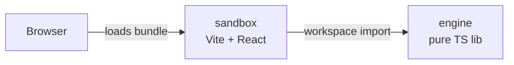

# Architecture

Companion to [AGENTS.md](./AGENTS.md) (the *why*) and
[CONVENTIONS.md](./CONVENTIONS.md) (the *how*). This file describes
the *what*: system shape, packages, dependency rules, the
browser/runtime model, and the reasoning behind non-trivial decisions.

## System overview

GEAAC ports TheCherno's Hazel game-engine architecture to the web.
The system is a pnpm-workspaces monorepo with two packages today
(engine and sandbox) and a third (editor) planned.



In the browser there is exactly one bundle. The package boundary
exists at build time (import resolution) and at source time
(folder separation), not at runtime.

## Repository layout

```text
Geaac/                          workspace root
|-- AGENTS.md
|-- CONVENTIONS.md
|-- ARCHITECTURE.md             this file
|-- package.json                root: scripts + devDeps only
|-- pnpm-workspace.yaml         declares packages/*
|-- tsconfig.base.json          shared TS strict settings
|-- .gitignore
|-- .npmrc
`-- packages/
    |-- engine/                 pure TS lib, no React, no DOM
    |   |-- package.json        name: @geaac/engine
    |   |-- tsconfig.json       composite, references: []
    |   `-- src/
    |       |-- index.ts        barrel, public API
    |       `-- ...             modules: log, event-bus, ...
    |
    `-- sandbox/                Vite + React app, depends on engine
        |-- package.json        name: @geaac/sandbox
        |-- tsconfig.json       references engine
        |-- vite.config.ts
        |-- index.html
        `-- src/
            |-- main.tsx
            |-- app.tsx
            `-- ...
```

## Packages

### `@geaac/engine`

Role: pure TypeScript library. All reusable engine code lives here.

Constraints:
- No React in `dependencies` or `devDependencies`.
- No browser-only APIs (`window`, `document`, `canvas`, ...).
- No imports from `@geaac/sandbox` or any future sibling package.

Why: keeps engine code testable in Node without a DOM, and reusable
across any consumer (sandbox today, editor tomorrow, third-party app
later). The package boundary is what enforces this; a lint rule
alone would not be sufficient.

Status: scaffolding today; real code starts with the first slice
(logger + event bus).

### `@geaac/sandbox`

Role: the consumer app. Runs and visualizes the engine.

Constraints: none. It is the top of the dependency graph.

Why: gives us a runnable artifact to validate engine behavior in a
real browser, and is the natural host for ad-hoc experiments while
developing engine modules.

Status: scaffolding today.

### `@geaac/editor` (planned)

Role: ImGui-style editor UI built on top of the engine.

Status: not yet scaffolded. Added when we reach the editor episode
in TheCherno's series.

## Dependency rules

The whole architecture is encoded in this matrix:

| From    | May import                                            |
|---------|-------------------------------------------------------|
| engine  | node stdlib, own modules                              |
| sandbox | engine, React, third-party libs                       |
| editor  | engine, sandbox rarely, React, Tailwind, shadcn/ui    |

Enforced by package boundaries. Engine has no React in its
`dependencies`, so any attempt to `import 'react'` from inside
`@geaac/engine` fails at link time.

## Browser / runtime model

The browser sees one bundle. The package boundary is build-time,
not runtime.

### Development

```text
pnpm dev
  `-- vite in packages/sandbox
       `-- reads packages/engine/src/* via workspace symlink
       `-- serves transformed TS on http://localhost:5173
       `-- HMR per module, no rebuild
```

### Production

```text
pnpm build
  `-- vite build in packages/sandbox
       `-- bundles engine + sandbox into dist/assets/index-[hash].js
       `-- deploy dist/ to any static host
```

## Inside-package layout (engine)

The engine package organizes code by concern, not by feature. Early
modules live as flat files in `packages/engine/src/`. As the engine
grows, sub-folders appear when a concern has >= 3 modules:

```text
packages/engine/src/
  index.ts             barrel; re-exports the public API only
  platform/            (later) abstractions over host environment
  events/              (later) event bus + concrete events
  core/                (later) entity, component, system base types
```

Public API rule: only what `index.ts` re-exports is part of the
engine's contract. Everything else is internal and may change
without notice. Sandbox (and later editor) imports only from
`@geaac/engine`, never from internal paths.

## Decision log

### 2026-07-25 - Monorepo from day one

- **Decision**: pnpm workspaces with `packages/engine` and `packages/sandbox`.
- **Rationale**: faithful port of TheCherno's two-project Hazel setup;
  enforces import direction at the package boundary; cost is ~5
  lines of config; editor slots in later without restructuring.
- **Alternatives**: single Vite project with `src/engine` +
  `src/sandbox`; defer monorepo until editor arrives. Both teach
  ~80% of the same lesson but skip the package-boundary enforcement.

### 2026-07-25 - No engine build step

- **Decision**: engine ships as TS source; Vite reads it directly.
- **Rationale**: simpler iteration; no publish step. The package
  boundary is the protection, not the artifact.
- **Trade-off**: engine cannot be consumed as a built artifact by
  non-Vite tooling. Acceptable for now.

### 2026-07-25 - Three-doc split for project knowledge

- **Decision**: AGENTS.md / CONVENTIONS.md / ARCHITECTURE.md as
  separate docs with non-overlapping concerns.
- **Rationale**: each doc stays small and scannable; AI tools load
  the right doc at the right time; mirrors how real projects
  organize documentation.

## Open questions

- Renderer abstraction: WebGL only, or WebGPU too? Defer.
- ECS: write our own or use a library? Defer to scene episode.
- Asset pipeline: serialization format? Defer to asset episode.
- Editor package layout: where do editor-only helpers live? Defer.
