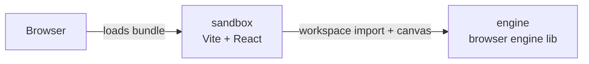

# Architecture

Companion to [AGENTS.md](./AGENTS.md) (the _why_) and
[CONVENTIONS.md](./CONVENTIONS.md) (the _how_). This file describes
the _what_: system shape, packages, dependency rules, the
browser/runtime model, and the reasoning behind non-trivial decisions.

## System overview

GEAAC ports TheCherno's Hazel game-engine architecture to the web.
The system is a pnpm-workspaces monorepo with two packages today
(engine and sandbox) and a third (editor) planned.



In the browser there is exactly one bundle. The package boundary
exists at build time (import resolution) and at source time
(folder separation), not at runtime.

## Repository layout

```text
Geaac/                          workspace root
|-- AGENTS.md
|-- CONVENTIONS.md
|-- ARCHITECTURE.md             this file
|-- docs/
|   `-- architecture/           hand-authored study pages (prettier-skipped)
|       |-- event-flow.html          EventBus 路由与 handled 截断
|       `-- window-event-bridge.html DOM → Event 桥梁 mental model
|-- package.json                root: scripts + devDeps only
|-- pnpm-workspace.yaml         declares packages/*
|-- tsconfig.base.json          shared TS strict settings
|-- .gitignore
|-- .npmrc
`-- packages/
    |-- engine/                 TypeScript browser engine, no React
    |   |-- package.json        name: @geaac/engine
    |   |-- tsconfig.json       composite, references: []
    |   `-- src/
    |       |-- index.ts        barrel, public API
    |       `-- ...             modules: log, event-bus, ...
    |
    `-- sandbox/                Vite + React app, depends on engine
        |-- package.json        name: @geaac/sandbox
        |-- tsconfig.json       references engine
        |-- vite.config.ts
        |-- index.html
        `-- src/
            |-- main.tsx
            |-- app.tsx
            `-- ...
```

## Packages

### `@geaac/engine`

Role: TypeScript browser engine library. All reusable engine code lives here.

Constraints:

- No React in `dependencies` or `devDependencies`.
- Browser APIs enter through explicit host inputs or platform/backend modules;
  engine code does not discover host elements through ambient DOM queries.
- No imports from `@geaac/sandbox` or any future sibling package.

Why: the engine owns the browser runtime and graphics integration, while the
consumer owns its DOM layout and supplies the canvas on which the engine will
render. Explicit inputs keep API-neutral engine code testable in Node and the
engine reusable across browser consumers.

Status: event pipeline complete — blocking EventBus, AppWindow DOM→Event
bridge (attach/detach), Application-owned bus, keyboard scoped to the canvas,
keyCode→code/key migration, React `useEvent` hook (single-type subscription),
and a data-driven sandbox event inspector.
Next: input consumption (`preventDefault` on game keys such as Space/arrows to
stop the page scrolling); wire `KeyTypedEvent` production (keydown where
`e.key.length === 1`) for future text input.

### `@geaac/sandbox`

Role: the consumer app. Runs and visualizes the engine.

Constraints: none. It is the top of the dependency graph.

Why: gives us a runnable artifact to validate engine behavior in a
real browser, and is the natural host for ad-hoc experiments while
developing engine modules.

Status: scaffolded (Vite + React 19, configures an engine application) with a
live event inspector (`EventFeed` + `EventInspector`) that surfaces every
listenable event type — count and latest payload per type, plus a rolling
stream, with per-frame AppTick/AppRender counted but stream-opt-in.

### `@geaac/editor` (planned)

Role: ImGui-style editor UI built on top of the engine.

Status: not yet scaffolded. Added when we reach the editor episode
in TheCherno's series.

## Dependency rules

The whole architecture is encoded in this matrix:

| From    | May import                                         |
| ------- | -------------------------------------------------- |
| engine  | web platform APIs, node stdlib, own modules        |
| sandbox | engine, React, third-party libs                    |
| editor  | engine, sandbox rarely, React, Tailwind, shadcn/ui |

Enforced by package boundaries. Engine has no React in its
`dependencies`, so any attempt to `import 'react'` from inside
`@geaac/engine` fails at link time.

## Browser / runtime model

The browser sees one bundle. The package boundary is build-time,
not runtime.

### Development

```text
pnpm dev
  `-- vite in packages/sandbox
       `-- reads packages/engine/src/* via workspace symlink
       `-- serves transformed TS on http://localhost:5173
       `-- HMR per module, no rebuild
```

### Production

```text
pnpm build
  `-- vite build in packages/sandbox
       `-- bundles engine + sandbox into dist/assets/index-[hash].js
       `-- deploy dist/ to any static host
```

### Entry point

`packages/sandbox/src/App.tsx` is the engine composition root. The React
component renders the host canvas and calls `createApplication` in a mount
effect once the element is attached, so the engine can never run before its
rendering surface exists. `packages/sandbox/src/main.tsx` is the React
bootstrap only: find `#root`, render `<App />`.

```text
browser loads main.tsx
  |-- React renders <App /> into #root
  `-- <App /> mounts
        |-- <canvas ref={canvasRef} /> becomes the host surface
        `-- createApplication({ name: "GEAAC Sandbox", canvas })
              |-- sandbox owns application configuration and DOM placement
              `-- engine owns application construction and retains the canvas
  `-- React renders the application UI
```

This preserves the architectural lesson from Hazel without copying its C++
linkage mechanism. Hazel needs the client to implement `CreateApplication` so
an engine-owned `main` can discover the concrete application at link time. In
the browser, `App.tsx` owns the canvas mount lifecycle, so an effect that
reads the canvas ref and calls the factory is the natural expression of that
boundary.

The `Application` class constructor initialises the logger and captures the
host canvas. `app.run()` begins a requestAnimationFrame loop (the browser
equivalent of Hazel's `while (m_Running)`). `app.close()` cancels the loop
and resets state, letting React's useEffect cleanup tear it down on unmount.
Rendering, events, and input remain deferred.

## Inside-package layout (engine)

The engine package organizes code by concern, not by feature. Early
modules live as flat files in `packages/engine/src/`. As the engine
grows, sub-folders appear when a concern has >= 3 modules:

```text
packages/engine/src/
  index.ts             barrel; re-exports the public API only
  application.ts       Application class with run/close lifecycle
  version.ts           build-time version constant
  log/                 level-filtered logging: Logger, ConsoleLogger, coreLogger
  events/              blocking EventBus + bit-flag categories + EventType enum
    category.ts          bit-flag EventCategory enum + isInCategory helper
    event-type.ts        sequential EventType enum + typed name registry
    event.ts             abstract Event base class
    dispatcher.ts        EventDispatcher<E> for instanceof-based dispatch
    bus.ts               EventBus: on(EventType.X, h) and onCategory(bits, h)
    application-events.ts, key-events.ts, mouse-events.ts,
    mouse-button-events.ts   concrete events, grouped by source
  platform/            (later) abstractions over host environment
  core/                (later) entity, component, system base types
```

Public API rule: only what `index.ts` re-exports is part of the
engine's contract. Everything else is internal and may change
without notice. Sandbox (and later editor) imports only from
`@geaac/engine`, never from internal paths.

## Decision log

### 2026-07-25 - Monorepo from day one

- **Decision**: pnpm workspaces with `packages/engine` and `packages/sandbox`.
- **Rationale**: faithful port of TheCherno's two-project Hazel setup;
  enforces import direction at the package boundary; cost is ~5
  lines of config; editor slots in later without restructuring.
- **Alternatives**: single Vite project with `src/engine` +
  `src/sandbox`; defer monorepo until editor arrives. Both teach
  ~80% of the same lesson but skip the package-boundary enforcement.

### 2026-07-25 - No engine build step

- **Decision**: engine ships as TS source; Vite reads it directly.
- **Rationale**: simpler iteration; no publish step. The package
  boundary is the protection, not the artifact.
- **Trade-off**: engine cannot be consumed as a built artifact by
  non-Vite tooling. Acceptable for now.

### 2026-07-25 - Three-doc split for project knowledge

- **Decision**: AGENTS.md / CONVENTIONS.md / ARCHITECTURE.md as
  separate docs with non-overlapping concerns.
- **Rationale**: each doc stays small and scannable; AI tools load
  the right doc at the right time; mirrors how real projects
  organize documentation.

### 2026-07-25 - Engine-owned application factory with injected canvas

- **Decision**: the engine exports `createApplication(config)`. The sandbox
  calls it from `App.tsx` with application-specific configuration and its host
  canvas.
- **Rationale**: the engine should own how an application is constructed while
  the client owns what it configures and where the canvas lives in the DOM. The
  engine receives the canvas because graphics context creation and rendering
  are engine responsibilities. Explicit arguments are the native TypeScript
  module mechanism for this boundary; a client-implemented factory would
  reproduce Hazel's C++ linker solution without its underlying need.
- **Naming**: use `Application`, `ApplicationConfig`, and `createApplication`.
  Avoid `Geaac` in symbol names because the `@geaac/engine` import already
  supplies that namespace. Use “config”, not “props”, because these are
  construction-time engine values rather than React render inputs.
- **Scope**: `Application` contains only identity and the injected canvas;
  `createApplication` does not initialize a graphics API. No `run` operation
  exists until there is lifecycle behavior to run.

### 2026-07-26 - Application becomes a class with run/close lifecycle

- **Decision**: Application was refactored from a plain type + factory to a
  class with `run()` and `close()` methods. The constructor initializes the
  logger, `run()` starts a requestAnimationFrame loop, and `close()` tears it
  down.
- **Rationale**: Hazel's Application owns its lifecycle (`m_Running` flag,
  `Run()` method). A class naturally encapsulates that state (`running`,
  `rAFId`, `frameCount`). In the browser, `run()` is non-blocking and delegates
  the loop to rAF rather than blocking the main thread. The `close()` method
  mirrors the destructor pattern and lets React's `useEffect` cleanup tear
  down the loop on unmount.
- **Scope**: `run()` only sets up the rAF loop and logs frame traces. No event
  polling, layer updates, or rendering yet. `close()` cancels the rAF and
  resets state. Calling `run()` after `close()` re-enters the loop.

### 2026-07-26 - Thin logging abstraction over console

- **Decision**: no third-party logging library. A `Logger` interface + `ConsoleLogger`
  implementation wraps `console.*` behind ~50 lines of engine-owned code. The engine
  exports a singleton `coreLogger` and a `createLogger` factory for consumers.
- **Rationale**: browsers don't need file sinks, JSON shipping, or async logging —
  console _is_ the sink. A thin wrapper gives us name tagging, level filtering,
  and dependency insulation without the weight of a Node-oriented logger.
- **Structure**: the module lives at `packages/engine/src/log/` (3+ files, hit the
  sub-folder threshold from day one). Two loggers follow Hazel's core/client split
  so engine internals and application code can have independent level controls.

### 2026-07-26 - Blocking event system with bit-flag categories

- **Decision**: port Hazel's `Event` / `EventDispatcher` / layer model into
  TypeScript as a blocking `EventBus` with bit-flag categories and a sequential
  `EventType` enum. Lives at `packages/engine/src/events/`.
- **Shape**:
  - `category.ts` — bit-flag `EventCategory` (`None`, `EventCategoryApplication`,
    `EventCategoryInput`, `EventCategoryKeyboard`, `EventCategoryMouse`,
    `EventCategoryMouseButton`).
  - `event-type.ts` — sequential `EventType` plus a `Record<EventTypeValue,
string>` for the typed reverse lookup.
  - `event.ts` — abstract `Event` base (`handled`, `eventType`, `categoryFlags`,
    `toString`, `name`).
  - `dispatcher.ts` — `EventDispatcher<E>` with `instanceof`-based
    `dispatch(ctor, handler)`.
  - `bus.ts` — `EventBus` with `on(EventType.X, h)`, `onCategory(bits, h)`,
    blocking `publish(event)`.
  - `application-events.ts`, `key-events.ts`, `mouse-events.ts`,
    `mouse-button-events.ts` — concrete events grouped by source.
- **Why blocking synchronous**: matches Hazel, debuggable call stacks, bounded
  event rate per frame. A slow handler stalls its own frame, not the bus.
- **Why `as const` instead of native `enum`**: native TS enums have weird
  runtime semantics and bundler quirks; `as const` is idiomatic modern TS and
  lets the value type derive as `(typeof X)[keyof typeof X]` automatically.
- **Why `EventType` even though TS has `instanceof`**: in C++ Hazel needs the
  enum because templates use static type comparison. In TS `instanceof` already
  does that job (the dispatcher uses it). The enum still earns its place as the
  bus's typed subscription key — `bus.on(EventType.KeyPressed, h)` is
  typo-proof, autocomplete-able, and a single source of truth for every event
  the engine can produce.
- **Why the `EventTypeName` `Record`**: TS cannot statically prove that
  `EventType[event.eventType]` is safe to index (object keys are string
  literals, not numbers). `Record<EventTypeValue, string>` forces the compiler
  to verify every enum member has a name — adding a new event type without
  naming it becomes a typecheck error, not a runtime `'Unknown'`.
- **Scope**: events are pure data + dispatch logic with zero browser API use,
  so the module stays Node-testable. Browser input wiring (`window`/`canvas`
  listeners, `Application`-owned bus, React `useEvent` hook) is intentionally
  the next slice.

## Open questions

- Renderer abstraction: WebGL only, or WebGPU too? Defer.
- ECS: write our own or use a library? Defer to scene episode.
- Asset pipeline: serialization format? Defer to asset episode.
- Editor package layout: where do editor-only helpers live? Defer.
